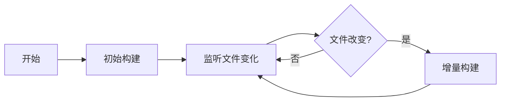

# 🔨 构建说明

## 📋 构建要求

- **Node.js**: >= 18
- **pnpm**: >= 9
- **操作系统**: Windows / macOS / Linux

## 🚀 快速开始

### 1. 安装依赖

```bash
# 全局安装 pnpm（如果还没有）
npm install -g pnpm

# 安装项目依赖
pnpm install
```

### 2. 构建项目

```bash
# 生产构建（压缩代码）
pnpm run build

# 或使用清理构建（先删除旧文件）
pnpm run build:clean
```

### 3. 开发模式

```bash
# 监听文件变化，自动重新构建
pnpm run dev
```

---

## 📦 构建脚本说明

### 核心构建脚本

| 命令 | 说明 | 使用场景 |
|------|------|---------|
| `pnpm run build` | 生产构建 | 发布版本 |
| `pnpm run build:clean` | 清理后构建 | 确保干净构建 |
| `pnpm run build:fast` | 快速构建 | 跳过预处理 |
| `pnpm run dev` | 开发模式 | 实时开发 |

### 代码质量检查

| 命令 | 说明 | 
|------|------|
| `pnpm run lint` | ESLint 检查 |
| `pnpm run lint:fix` | 自动修复 lint 问题 |
| `pnpm run format` | Prettier 格式检查 |
| `pnpm run format:fix` | 自动格式化代码 |
| `pnpm run tsc` | TypeScript 类型检查 |
| `pnpm run svelte` | Svelte 组件检查 |
| `pnpm run check` | TypeScript + Svelte 检查 |
| `pnpm run all` | 完整代码质量检查 |

### 辅助脚本

| 命令 | 说明 |
|------|------|
| `pnpm run clean` | 清理构建文件 |
| `pnpm run release` | 创建新版本 |

---

## 🎯 构建流程详解

### 生产构建流程


**执行步骤**:
1. 🧹 清理旧的 main.js
2. 📦 编译 TypeScript 和 Svelte
3. 🗜️ 压缩和优化代码
4. 🌳 移除未使用的代码
5. 📊 显示最终文件大小

### 开发模式流程



**特点**:
- 🔄 自动监听文件变化
- ⚡ 增量构建（只编译修改的文件）
- 🗺️ 生成 source map
- 🐛 保留调试信息

---

## ⚙️ 构建优化

### 1. esbuild 配置优化

**生产环境**:
- ✅ 代码压缩 (`minify: true`)
- ✅ Tree Shaking（移除未使用代码）
- ✅ 无 source map（减小文件大小）
- ✅ UTF-8 编码支持（中文优化）
- ✅ 移除法律注释

**开发环境**:
- ✅ 内联 source map
- ✅ 快速重新构建
- ✅ 详细错误信息

### 2. TypeScript 优化

- ✅ 增量编译 (`incremental: true`)
- ✅ 跳过库文件检查 (`skipLibCheck`)
- ✅ 严格空值检查
- ✅ ES Module 互操作

### 3. pnpm 优化

- ✅ 符号链接（减少磁盘占用）
- ✅ 自动安装 peer dependencies
- ✅ 严格模式禁用（兼容性）

---

## 📊 构建输出

### 典型的生产构建输出

```
🔨 构建模式: 生产环境 (Production)
📦 目标文件: main.js
🌐 i18n 支持: 中文/English

🧹 清理旧构建文件...
🚀 开始生产构建...

✅ 构建完成！
📄 输出文件: main.js
🎯 已启用: 代码压缩, Tree Shaking, i18n 支持
📦 main.js: ~650 KB
```

### 构建文件说明

| 文件 | 大小 | 说明 |
|------|------|------|
| `main.js` | ~650 KB | 主程序（包含所有依赖和翻译） |
| `manifest.json` | ~0.5 KB | 插件清单 |
| `styles.css` | ~10 KB | 样式文件 |

---

## 🧪 测试构建

### 快速测试

```bash
# 1. 清理旧文件
pnpm run clean

# 2. 全新构建
pnpm run build

# 3. 检查输出
ls -lh main.js
```

### 完整测试

```bash
# 运行所有检查
pnpm run all

# 包括:
# - TypeScript 类型检查
# - Svelte 组件检查
# - 代码格式检查
# - ESLint 检查
```

---

## 🐛 常见问题

### Q: 构建失败怎么办？

**A**: 按顺序尝试：
```bash
# 1. 清理并重新安装依赖
pnpm run clean
rm -rf node_modules
pnpm install

# 2. 重新构建
pnpm run build
```

### Q: 构建很慢？

**A**: 使用快速构建：
```bash
pnpm run build:fast
```

### Q: 想看详细的构建过程？

**A**: esbuild 会自动显示详细信息，或者：
```bash
# 设置更详细的日志
pnpm run build --loglevel=debug
```

### Q: 如何验证 i18n 是否正确打包？

**A**: 
```bash
# 1. 构建
pnpm run build

# 2. 检查 main.js 中是否包含中文
grep -a "没有要提交的更改" main.js
# 应该能找到中文翻译文本
```

---

## 🔧 高级配置

### 自定义构建目标

编辑 `esbuild.config.mjs`:

```javascript
// 修改输出文件名
outfile: "main.js",

// 修改目标 ES 版本
target: "es2018",

// 添加额外的外部依赖
external: ["your-package"],
```

### 优化包大小

当前优化措施：
- ✅ Tree Shaking（自动移除未使用代码）
- ✅ 代码压缩（minify）
- ✅ 外部化 Obsidian API
- ✅ 移除 source map（生产环境）

---

## 📈 性能对比

### 构建时间

| 模式 | 首次构建 | 增量构建 |
|------|---------|---------|
| 开发模式 | ~5-10秒 | <1秒 |
| 生产模式 | ~8-15秒 | N/A |

### 文件大小

| 配置 | main.js 大小 |
|------|-------------|
| 开发模式（未压缩） | ~1.2 MB |
| 生产模式（已压缩） | ~650 KB |

*大小会根据依赖版本略有变化*

---

## 🚀 CI/CD 集成

### GitHub Actions 示例

```yaml
name: Build
on: [push, pull_request]

jobs:
  build:
    runs-on: ubuntu-latest
    steps:
      - uses: actions/checkout@v3
      - uses: pnpm/action-setup@v2
        with:
          version: 9
      - uses: actions/setup-node@v3
        with:
          node-version: 18
          cache: 'pnpm'
      - run: pnpm install
      - run: pnpm run build
      - run: pnpm run all
```

---

## 📝 构建检查清单

发布前确认：

- [ ] 运行 `pnpm run all` 通过
- [ ] 运行 `pnpm run build` 成功
- [ ] 检查 `main.js` 文件存在且大小合理
- [ ] 在 Obsidian 中测试功能
- [ ] 验证中文界面显示正常
- [ ] 验证英文界面显示正常
- [ ] 检查 `manifest.json` 版本号正确

---

## 🎓 开发建议

### 开发工作流

```bash
# 1. 启动开发模式
pnpm run dev

# 2. 修改代码（自动重新构建）

# 3. 在 Obsidian 中重新加载插件测试

# 4. 代码检查
pnpm run check

# 5. 提交前完整检查
pnpm run all
```

### 性能优化建议

1. **减小包体积**
   - 检查是否有未使用的依赖
   - 使用动态导入拆分代码（如果需要）
   - 优化图片和资源文件

2. **提升构建速度**
   - 使用 `pnpm` 而非 `npm`
   - 启用增量编译
   - 缓存 `node_modules`

3. **代码质量**
   - 启用所有 TypeScript 严格检查
   - 使用 ESLint 和 Prettier
   - 定期运行 `pnpm run all`

---

## 🔗 相关资源

- [esbuild 文档](https://esbuild.github.io/)
- [Obsidian 插件开发文档](https://docs.obsidian.md/Plugins/Getting+started/Build+a+plugin)
- [pnpm 文档](https://pnpm.io/)
- [TypeScript 配置](https://www.typescriptlang.org/tsconfig)

---

**构建愉快！** 🎉
